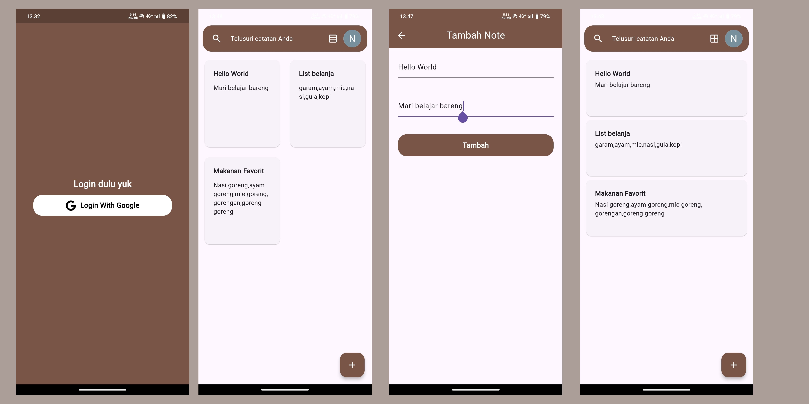
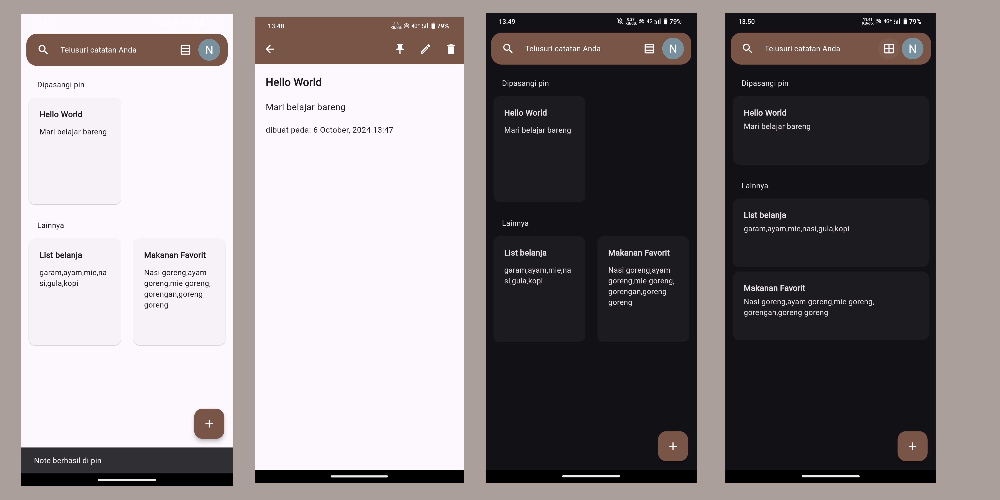

# Nelnotes
Nelnotes adalah aplikasi untuk mencatat catatan.Nelnotes dibuat untuk mengimplementasikan hasil belajar state management Bloc.

Fitur-fitur yang ada di nelnotes:
<li>tambah,hapus,edit note</li>
<li>cari note</li>
<li>pin note</li>
<li>dark mode</li>
<li>ubah layout(grid/row)</li>

## Link download Aplikasi
[>Download Nelnotes<](https://drive.google.com/file/d/1QjOY86B5LAeQLw2Ahr4jDjLrGeKj3DeZ/view?usp=drive_link)

## Preview Nelnotes
### Preview 1

### Preview 2

